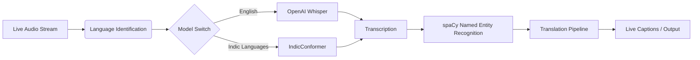

# Hi, I'm Deep Habiswashi 👋

<!-- 3D Animated Header -->

  

  

AI / ML Engineer • Software Engineer • Building Intelligent Systems

---

# 👨‍💻 About Me

I am a **final-year B.Tech student in Electronics & Computer Science Engineering at KIIT University, Bhubaneswar**.

My work focuses on building **AI systems, real-time machine learning pipelines, generative models, and scalable backend infrastructure**.

I enjoy designing **end-to-end intelligent systems** — from model research and training to production deployment.

💡 Current Interests

* Artificial Intelligence
* Machine Learning Systems
* Generative AI
* Natural Language Processing
* Real-time AI pipelines
* Backend engineering for ML systems

---

# 👀 Profile Visitors

---

# 🌐 Connect With Me

* 📧 Email: [deephabiswashi@gmail.com](mailto:deephabiswashi@gmail.com)
* 💼 LinkedIn: [https://www.linkedin.com/in/deep-habiswashi-54492b295/](https://www.linkedin.com/in/deep-habiswashi-54492b295/)
* 🌐 GitHub: [https://github.com/deephabiswashi](https://github.com/deephabiswashi)
* 🐦 Twitter: [https://twitter.com/Habiswashi_Deep](https://twitter.com/Habiswashi_Deep)
* 📸 Instagram: [https://instagram.com/night_bred](https://instagram.com/night_bred)
* 📝 Blog: [https://scorchedwithwords.blogspot.com/](https://scorchedwithwords.blogspot.com/)

---

# 🚀 Tech Stack

## Programming Languages

## AI / Machine Learning

* Deep Learning
* Neural Networks
* Computer Vision
* Transfer Learning
* Generative Adversarial Networks (DCGAN, CGAN, BigGAN, StarGAN)

## Natural Language Processing

* LangChain
* Ollama
* OpenAI Whisper
* spaCy
* Named Entity Recognition (NER)
* Retrieval Augmented Generation (RAG)
* Language Identification
* AI4Bharat IndicConformer

## Data Science

* NumPy
* Pandas
* Feature Engineering
* Statistical Analysis
* Model Evaluation

## Backend Development

* Flask
* REST APIs
* AJAX
* Backend Architecture

## Databases

* MongoDB
* NoSQL
* Database Design

## DevOps & Tools

---

# 🤖 AI System Architecture

---

# 🧠 Key Projects

## 🌍 Real-Time Multilingual AI Translation System

**Tech:** Python • Whisper • spaCy • LangChain • IndicConformer

* Built a **real-time AI translation pipeline for live streaming platforms**.
* Integrated **Language Identification, ASR, and Neural Translation**.
* Implemented **dynamic switching between Whisper and IndicConformer models**.
* Built **NER-preserving translation to retain proper nouns across languages**.

🔗 [https://github.com/deephabiswashi/Vasha-AI](https://github.com/deephabiswashi/Vasha-AI)

---

## 🗄 MongoDB Management Platform

**Tech:** Flask • MongoDB • AJAX • Docker

* Developed **full-stack MongoDB management platform** with CRUD operations.
* Implemented **Excel/CSV import-export for large datasets**.
* Built **REST API backend with Flask**.
* Containerized system using **Docker**.

🔗 [https://github.com/deephabiswashi/mongodb-manager-web-app](https://github.com/deephabiswashi/mongodb-manager-web-app)

---

## 🎭 EmotionGANverse — Multi-GAN Image Generation Framework

**Tech:** TensorFlow • OpenCV • GANs

* Implemented **DCGAN, CGAN, BigGAN, StarGAN architectures**.
* Built unified **training pipelines for facial emotion synthesis**.
* Trained on **FER-2013 dataset (35k+ images)**.

---

## 📚 RAG Conversational Document Chatbot

**Tech:** LangChain • Ollama • Flask

* Built chatbot capable of answering questions from **PDF, Word, and Excel files**.
* Implemented **vector embeddings + RAG pipeline**.

---

## 🧠 EEG Seizure Detection System

**Tech:** TensorFlow • CNN • VGG16

* Developed EEG preprocessing pipeline using **wavelet transforms**.
* Built **1D CNN classifier with transfer learning**.

---

# 📌 Featured Projects

---

# 📈 Contribution Graph

---

# 🔥 GitHub Streak Stats

---

# 🧩 AI / ML Research Focus

* Generative AI
* Multilingual AI systems
* Speech Recognition
* Machine Learning Infrastructure
* Real-time AI pipelines
* LLM applications

---

# 🏅 Certifications & Achievements

* Google — Foundations: Data, Data, Everywhere
* IBM — Generative AI: Introduction & Applications
* IBM — What is Data Science?
* Microsoft — Python & AI Bootcamp
* Best Project Recognition — Kreativity 2.0 Project Expo (KIIT DU)
* HP Power Lab & Tata Imagination Challenge 2024

---

# 🤝 Open to Collaborations

I’m always interested in collaborating on:

* AI / ML research projects
* Open-source ML systems
* Generative AI applications
* Real-time AI infrastructure

⭐ If you like my work, consider **starring my repositories**!

---

